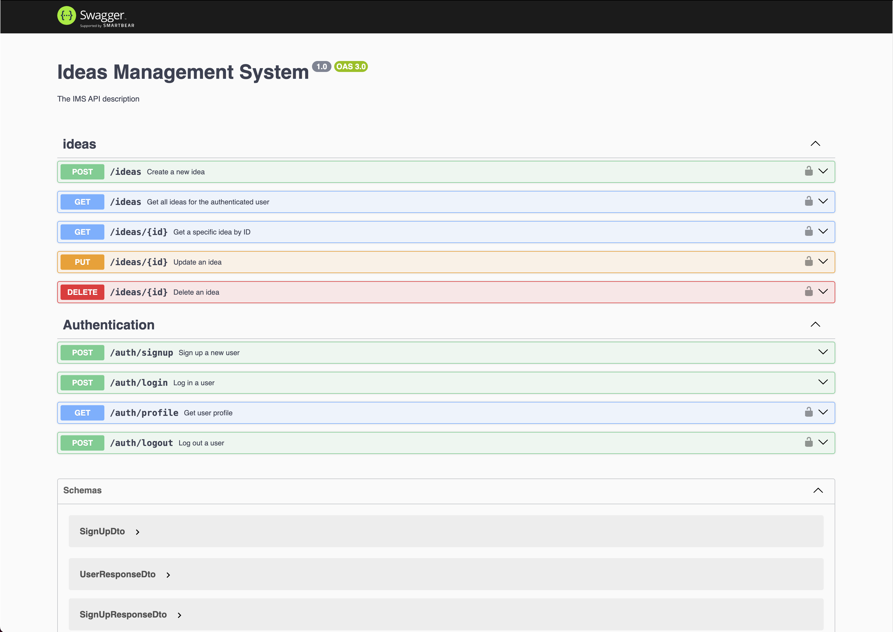

## Description

This project is a robust and scalable backend service built with a modern tech stack, designed to manage ideas and users efficiently.



### Tech Stack
- TypeScript
- NestJS
- MongoDB
- Docker & Docker Compose
- pnpm (Package Manager)

### Architecture Overview
The application is currently structured as a monolith due to the simplicity of requirements and time constraints. However, it's designed with modularity in mind, allowing for easy transition to a microservices architecture if needed. The ideas and users are managed in separate modules with minimal interdependencies, facilitating potential future separation.

Database Strategy:
- Current Implementation: We use a single, centralized MongoDB database for all services.
- Future Flexibility: The system is designed to easily accommodate a transition to a microservices architecture. In such a scenario, each microservice could have its own isolated MongoDB database, promoting service independence and scalability.
- Decision Factors: The choice between a centralized database and separate databases for each service will depend on specific project needs, scale requirements, and operational complexity.

### Key Features
1. **Comprehensive Authentication**: An AuthGuard is applied globally to all endpoints, with a `@Public()` decorator available for opting out specific routes.

2. **Logout Mechanism**: Upon logout, JWT tokens are invalidated using a blacklist with self-expiring documents.

3. **API Documentation**: Fully documented REST API endpoints and DTOs using Swagger. Available at [`http://localhost:3000/swagger`](http://localhost:3000/swagger), with OpenAPI JSON definition downloadable from [`http://localhost:3000/swagger-json`](http://localhost:3000/swagger-json).

4. **Production-Ready**: The production build disables verbose errors in responses for enhanced security.

5. **Flexible Docker Configurations**: Two Docker setups are provided - one for running tests and another for production. The production build is optimized using multi-stage Docker builds.

6. **Environment-Driven Configuration**: The service is driven by a typed configuration that can be loaded from:
   - `.env` files for local development.
   - Environment variables when deployed in Docker, allowing for flexible configuration in different deployment environments.

### Local setup

```bash
$ pnpm install
```

### Docker setup

To run the application using Docker, make sure you have Docker and Docker Compose installed on your system.

#### Production setup

```bash
# Build and start the containers
$ docker-compose up --build

# To run in detached mode
$ docker-compose up -d --build

# To stop the containers
$ docker-compose down
```

The application will start automatically when you run `docker-compose up`. You can access it at [http://localhost:3000](http://localhost:3000).

Note: The Dockerfile uses a multi-stage build process, resulting in a smaller and more secure production image.

#### Test setup with Docker Compose

To run tests using Docker Compose:

1. Create a `.env.test` file in the project root with the necessary environment variables for testing.

2. Use the `docker-compose.test.yml` file to run tests:

```bash
# Run unit tests
$ docker-compose -f docker-compose.test.yml run --rm test

# Run e2e tests
$ docker-compose -f docker-compose.test.yml run --rm test pnpm run test:e2e

# Run test coverage
$ docker-compose -f docker-compose.test.yml run --rm test pnpm run test:cov
```

These commands will spin up a complete testing environment, including a separate MongoDB instance for testing, and run the tests in a Docker container.

Note: The `test` service in `docker-compose.test.yml` uses `Dockerfile.dev`, which is configured for running tests and development purposes.

## Compile and run the project

### Local development

```bash
# development
$ pnpm run start

# watch mode
$ pnpm run start:dev

# production mode
$ pnpm run start:prod
```

## Run tests

```bash
# unit tests
$ pnpm run test

# e2e tests
$ pnpm run test:e2e

# test coverage
$ pnpm run test:cov
```

## Test coverage

The project has a comprehensive test suite with good coverage. Here's a summary of the latest test coverage results:

```
> jest --coverage

 PASS  src/api-config/api-config.service.spec.ts (8.463 s)
 PASS  src/roles/roles.service.spec.ts (9.209 s)
 PASS  src/ideas/ideas.service.spec.ts (9.303 s)
 PASS  src/auth/utils/extract-token.util.spec.ts
 PASS  src/users/users.service.spec.ts (9.421 s)
 PASS  src/auth/auth.guard.spec.ts (9.513 s)
 PASS  src/auth/auth.service.spec.ts (9.59 s)
 PASS  src/auth/auth.controller.spec.ts
 PASS  src/ideas/ideas.controller.spec.ts (10.303 s)
-------------------|---------|----------|---------|---------|-------------------
File               | % Stmts | % Branch | % Funcs | % Lines | Uncovered Line #s
-------------------|---------|----------|---------|---------|-------------------
All files          |   74.18 |    84.21 |   74.24 |   75.71 |
 src               |       0 |      100 |       0 |       0 |
  app.module.ts    |       0 |      100 |       0 |       0 | 1-33
  main.ts          |       0 |      100 |       0 |       0 | 1-37
 src/api-config    |   70.27 |    66.66 |      90 |      75 |
  ...fig.module.ts |       0 |      100 |     100 |       0 | 1-17
  ...ig.service.ts |     100 |      100 |     100 |     100 |
  configuration.ts |       0 |        0 |       0 |       0 | 1-21
 src/auth          |   79.69 |     90.9 |   78.94 |   80.99 |
  ...controller.ts |     100 |      100 |     100 |     100 |
  auth.guard.ts    |     100 |      100 |     100 |     100 |
  auth.module.ts   |       0 |      100 |       0 |       0 | 1-46
  auth.service.ts  |   80.76 |    83.33 |   66.66 |   83.33 | 34-47
  ....decorator.ts |     100 |      100 |     100 |     100 |
 src/auth/dto      |     100 |      100 |     100 |     100 |
  auth.dto.ts      |     100 |      100 |     100 |     100 |
 src/auth/schemas  |     100 |      100 |     100 |     100 |
  ...ken.schema.ts |     100 |      100 |     100 |     100 |
 src/auth/utils    |     100 |      100 |     100 |     100 |
  ...token.util.ts |     100 |      100 |     100 |     100 |
 src/database      |       0 |        0 |       0 |       0 |
  seed-roles.ts    |       0 |        0 |       0 |       0 | 1-18
 src/ideas         |   85.45 |      100 |     100 |   87.75 |
  ...controller.ts |     100 |      100 |     100 |     100 |
  ideas.module.ts  |       0 |      100 |     100 |       0 | 1-14
  ideas.service.ts |     100 |      100 |     100 |     100 |
 src/ideas/dto     |   91.66 |      100 |       0 |   91.66 |
  idea.dto.ts      |   91.66 |      100 |       0 |   91.66 | 28,33
 src/ideas/schemas |     100 |      100 |     100 |     100 |
  idea.schema.ts   |     100 |      100 |     100 |     100 |
 src/roles         |   71.87 |      100 |      75 |      75 |
  roles.module.ts  |       0 |      100 |     100 |       0 | 1-13
  roles.service.ts |      92 |      100 |      75 |    91.3 | 34-38
 src/roles/schemas |     100 |      100 |     100 |     100 |
  role.schema.ts   |     100 |      100 |     100 |     100 |
 src/users         |   71.79 |    85.71 |   66.66 |   74.28 |
  users.module.ts  |       0 |      100 |     100 |       0 | 1-15
  users.service.ts |   90.32 |    85.71 |   66.66 |   89.65 | 21,43,66
 src/users/schemas |     100 |      100 |     100 |     100 |
  user.schema.ts   |     100 |      100 |     100 |     100 |
-------------------|---------|----------|---------|---------|-------------------

Test Suites: 9 passed, 9 total
Tests:       78 passed, 78 total
Snapshots:   0 total
Time:        19.008 s
Ran all test suites.
```


Strength areas:
1. Core logic files (services, controllers, guards, etc.) have excellent coverage, with many reaching 100%.
2. Critical components like authentication, authorization, and data processing are thoroughly tested.


To run the test coverage report, use the following command:

```bash
pnpm run test:cov
```

## End-to-End (e2e) Tests

The project includes comprehensive end-to-end test suites that cover critical functionality:

1. Authentication (auth.e2e-spec.ts):
   - User signup
   - User login
   - Profile retrieval
   - Logout functionality
   - Error handling for invalid credentials and unauthorized access

2. Ideas Management (ideas.e2e-spec.ts):
   - Creating new ideas
   - Retrieving all ideas for a user
   - Fetching a specific idea
   - Updating an existing idea
   - Deleting an idea
   - Error handling for non-existent ideas


To run the e2e tests, use the following command:

```bash
pnpm run test:e2e
```

## API Usage Examples

Here's a series of curl commands demonstrating the main functionalities of the API. Make sure to replace `<your-jwt-token>` with the actual JWT token you receive after logging in.

```bash
# 1. Sign up a new user
# Note: The API supports pre-seeded roles: 'admin', 'user', and 'editor'
curl -X POST http://localhost:3000/auth/signup \
  -H "Content-Type: application/json" \
  -d '{"username": "newuser@example.com", "password": "password123", "role": "user"}'

# You can also create users with other pre-seeded roles:
# curl -X POST http://localhost:3000/auth/signup \
#   -H "Content-Type: application/json" \
#   -d '{"username": "admin@example.com", "password": "adminpass", "role": "admin"}'
# 
# curl -X POST http://localhost:3000/auth/signup \
#   -H "Content-Type: application/json" \
#   -d '{"username": "editor@example.com", "password": "editorpass", "role": "editor"}'

# 2. Log in with the new user credentials
curl -X POST http://localhost:3000/auth/login \
  -H "Content-Type: application/json" \
  -d '{"username": "newuser@example.com", "password": "password123"}'

# 3. Get user profile (authenticated request)
curl -X GET http://localhost:3000/auth/profile \
  -H "Authorization: Bearer <your-jwt-token>"

# 4. Create a new idea
curl -X POST http://localhost:3000/ideas \
  -H "Authorization: Bearer <your-jwt-token>" \
  -H "Content-Type: application/json" \
  -d '{"title": "My Brilliant Idea", "description": "This idea will change the world!"}'

# 5. Get all ideas for the authenticated user
curl -X GET http://localhost:3000/ideas \
  -H "Authorization: Bearer <your-jwt-token>"

# 6. Get a specific idea by ID (replace <idea-id> with an actual idea ID)
curl -X GET http://localhost:3000/ideas/<idea-id> \
  -H "Authorization: Bearer <your-jwt-token>"

# 7. Update an existing idea (replace <idea-id> with an actual idea ID)
curl -X PUT http://localhost:3000/ideas/<idea-id> \
  -H "Authorization: Bearer <your-jwt-token>" \
  -H "Content-Type: application/json" \
  -d '{"title": "My Updated Brilliant Idea"}'

# 8. Delete an idea (replace <idea-id> with an actual idea ID)
curl -X DELETE http://localhost:3000/ideas/<idea-id> \
  -H "Authorization: Bearer <your-jwt-token>"

# 9. Log out (invalidate the JWT token)
curl -X POST http://localhost:3000/auth/logout \
  -H "Authorization: Bearer <your-jwt-token>"
```

These curl commands demonstrate the full lifecycle of user authentication and idea management in the API. They cover user registration, login, profile retrieval, idea creation, retrieval, updating, deletion, and finally, user logout.

Remember to replace `<your-jwt-token>` with the actual token received after login, and `<idea-id>` with real idea IDs when testing specific idea operations.

## Environment Configuration

The project includes three example environment files that can be used for different setups. To use these files:

Copy the appropriate .example file to create the actual .env file:
   ```bash
   cp .example.env.dev .env  # For local development
   cp .example.env.test .env.test  # For testing
   cp .example.env.prod .env  # For production
   ```

Remember to never commit your actual .env files to version control, as they may contain sensitive information.

